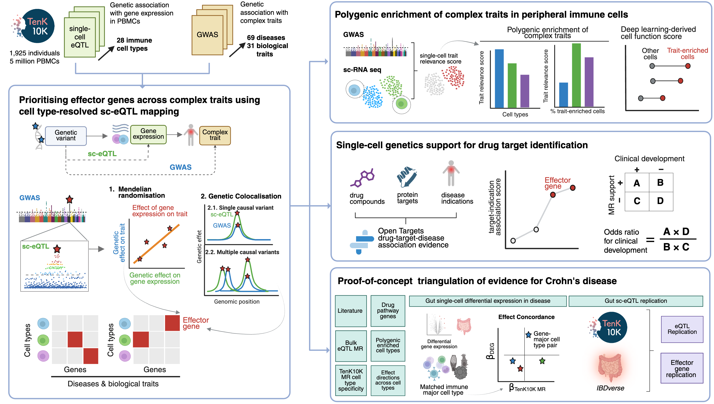

# TenK10K Phase1 effector genes identification manuscript


[](https://www.medrxiv.org/content/10.1101/2025.08.28.25334614v4)


## Study design


## Overview

This repository contains code, data, and workflows for the TenK10K effector genes manuscript. The project is organized into several directories, each corresponding to a major analysis step or component.

## Directory Structure

- **`figures/`**  
  Contains figures generated for the manuscript, including study design diagrams.

- **`metadata/`**  
  Contains metadata files for traits, trait categories, and cell types from TenK10K Phase 1 sc-eQTL analysis.

- **`scripts/`**  
  Main analysis scripts, organized by analysis section:
  - **`0-preprocess/`** - Shared preprocessing of the aggregate results
  - **`1-overview/`** - Study overview and summary statistics  
  - **`2-mr/`** - Mendelian randomisation analyses and comparisons
  - **`3-comparison/`** - Overlap between MR, coloc, MAGMA and eQTLGen
  - **`4-polygenic/`** - Polygenic enrichment analyses (scDRS, scDeepID)
  - **`5-drug/`** - Drug target enrichment and therapeutic relevance
  - **`6-crohns/`** - Crohn's disease case study
  - **`util/`** - Utility functions and helper scripts

- **`metadata/`**, **`config/`**, **`workflow/envs/`**, **`resources/{misc,scdrs/config}/`**  
  Small tracked configuration and metadata that the code needs in order to run:
  trait and cell-type metadata, gene annotation, conda environment specs,
  file-map templates and analysis parameters.

- **`sensitivity`**
  Snakemake pipeline for running sensitivity analyses for MR using [IVW-MR](https://mrcieu.github.io/TwoSampleMR/index.html) and [MR-link-2](https://github.com/adriaan-vd-graaf/mrlink2). This workflow reads in the intermediate results of the main MR pipeline to extract genes and instruments sets. sc-eQTL and GWAS summary statistics are also reformatted for use with these methods. 
    
- **`workflow/`**  
  Snakemake pipeline for reproducible data processing and analysis. The workflow handles data formatting, quality control, statistical analyses, and intermediate file generation.

## Usage

> [!NOTE]
> Every path in this repository is set to a **working directory** which _assumes_
> availability of full data in `resources/` (inputs) and `results/` (outputs) directories.
> However, due to data restrictions, raw data and some intermediate files are not included in this repository (see [Data Availability](#data-availability)) and therefore, parts of the code cannot be run end-to-end by a third party.
> The repository is provided for transparency and reproducibility of the analyses described in the manuscript.

1. **Run the Snakemake workflow** to generate the aggregate results.
   ```bash
   snakemake --snakefile workflow/snakefile \
             --profile workflow/profiles/default
   ```

2. **Run analysis scripts** (generates figures and tables):
   ```bash
   # Shared preprocessing - sourced by nearly every script below
   Rscript scripts/0-preprocess/preprocess_results.R

   # Overview analysis
   Rscript scripts/1-overview/study_design.R

   # Mendelian randomisation
   Rscript scripts/2-mr/mr_results_main.R

   # Method comparison
   Rscript scripts/3-comparison/coloc_mr_overlap.R

   # Polygenic analyses
   Rscript scripts/4-polygenic/scDRS/scdrs_main_supp.R

   # Drug target analysis
   Rscript scripts/5-drug/otp_combined.R

   # Crohn's disease case study
   Rscript scripts/6-crohns/crohns_case_study/plot_figures/3-annotated_heatmap.R
   ```

### Detailed Instructions

For detailed instructions on each analysis step, see the README files in each subdirectory:
- [`workflow/README.md`](workflow/README.md) - Snakemake pipeline setup and execution
- [`scripts/0-preprocess/README.md`](scripts/0-preprocess/README.md) - Data preprocessing
- [`scripts/1-overview/README.md`](scripts/1-overview/README.md) - Study overview and design
- [`scripts/2-mr/README.md`](scripts/2-mr/README.md) - Mendelian randomisation analysis
- [`scripts/4-polygenic/README.md`](scripts/4-polygenic/README.md) - Polygenic enrichment analysis
- [`scripts/5-drug/README.md`](scripts/5-drug/README.md) - Drug target enrichment
- [`scripts/6-crohns/README.md`](scripts/6-crohns/README.md) - Crohn's disease case study
- [`sensitivity/README.md`](sensitivity/README.md) - Mendelian randomisation - Sensitivity analysis


## Data Availability

Aggregated summary statistics — the MR, colocalisation and related result
tables — will be deposited on Hugging Face following manuscript
publication. The sc-eQTL summary statistics are released separately as described in the main [TenK10K phase 1 sc-eQTL mapping study (Cuomo et al.)](https://www.medrxiv.org/content/10.1101/2025.03.20.25324352v2).

Data that are not currently included in this repository:
- Individual-level single-cell expression and genotypes of the TenK10K donors

Third-party data (please refer to the original publications for access):
- [Kong et al. 2023 single-cell transcriptomics from colon tissues](https://pubmed.ncbi.nlm.nih.gov/36720220/)
- [AIFI Immune Health Atlas (Gong et al. 2025)](https://doi.org/10.1038/s41586-025-09686-5)
- [IBDverse single-cell transcriptomics atlas (Alegbe T, Harris BT, et al.)](https://doi.org/10.1038/s41586-025-09686-5)

## Citation

If you use this code or data in your research, please consider citing

**Preprint**:

Henry, A., Senabouth, A., Tyebally, R., et al. Single-cell genetics identifies cell type-specific causal mechanisms in complex traits and diseases. medRxiv 2025.08.28.25334614 (2025) doi:10.1101/2025.08.28.25334614

[medRxiv link](https://www.medrxiv.org/content/10.1101/2025.08.28.25334614v2)

See [`CITATION.md`](CITATION.md) for citations on specific methods / datasets used in this study.


## Acknowledgments

- TenK10K study members and contributors
- Data providers and consortia (eQTLGen, IBDverse, GWAS consortia, STRING, Open Targets)
- Software developers & maintainers (Snakemake, R/Bioconductor, R Tidyverse, Python scientific computing ecosystem, MAGMA, scDRS, PLINK)
- Computational resources and support teams (Australia National Computing Infrastructure, Garvan Institute Data Science Platform)
